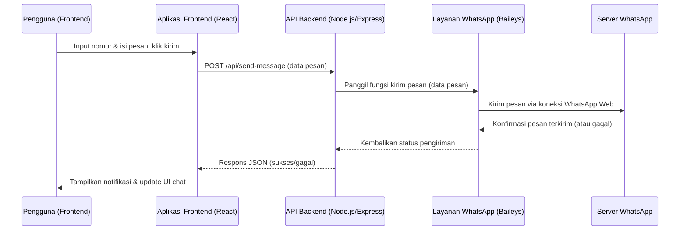

# Alur Kerja Aplikasi

## Inisialisasi Backend

Backend aplikasi ini dibangun menggunakan Node.js dengan framework Express.js.

### Pengaturan Server Utama (`backend/server.js`)

File `backend/server.js` bertanggung jawab untuk:
1.  **Inisialisasi Express App**: Membuat instance dari aplikasi Express.
2.  **Middleware**:
    *   `bodyParser`: Untuk mem-parsing body permintaan (JSON dan URL-encoded).
    *   `morgan`: Untuk logging permintaan HTTP (request logging). Ada dua konfigurasi: satu untuk menyimpan log ke file `logs/access.log` dan satu lagi untuk output ke konsol (mode 'dev').
    *   `express-rate-limit`: Untuk membatasi jumlah permintaan dari satu IP (rate limiting) guna mencegah abuse.
    *   Custom middleware: Menambahkan header (`X-No-Reload`, `Cache-Control`, `Pragma`, `Expires`) untuk mencoba mencegah browser me-reload halaman secara otomatis.
3.  **Direktori Penting**: Memastikan direktori seperti `sessions` dan `logs` ada sebelum server berjalan menggunakan `fs.ensureDirSync`.
4.  **Variabel Lingkungan**: Memuat variabel lingkungan dari file `.env` menggunakan `dotenv`.
5.  **Pengaturan Server HTTP**: Membuat server HTTP standar menggunakan modul `http` Node.js, yang kemudian digunakan bersama dengan aplikasi Express.
6.  **Inisialisasi WebSocket**: Memanggil `initWebSocket(server)` dari `backend/services/websocket.js` untuk menginisialisasi server WebSocket, melewatkan instance server HTTP agar WebSocket dapat berjalan pada path yang sama.
7.  **Penanganan Rute**: Menggunakan rute utama yang didefinisikan dalam `backend/routes/index.js` untuk semua permintaan yang masuk ke `/api`.
8.  **Penanganan Error**: Middleware penanganan error global untuk menangkap dan merespons kesalahan server (status 500).
9.  **Menjalankan Server**: Server dijalankan pada port yang ditentukan oleh variabel lingkungan `PORT` atau default ke `3002`.

### Definisi Rute (`backend/routes/index.js`)

File `backend/routes/index.js` mendefinisikan semua endpoint API aplikasi:
1.  **Router Express**: Membuat instance `express.Router()`.
2.  **Import Controller**: Mengimpor berbagai fungsi controller dari direktori `backend/controllers/` (misalnya, `whatsapp.js`, `gemini.js`, `contacts.js`, `contactCategories.js`). Controller ini berisi logika untuk menangani permintaan API.
3.  **Middleware Otentikasi**: Menggunakan middleware `authenticate` dari `backend/middleware/auth.js` untuk melindungi rute-rute tertentu, memastikan hanya pengguna terotentikasi yang dapat mengaksesnya.
4.  **Pengaturan Multer**: Mengkonfigurasi `multer` untuk menangani unggahan file (misalnya, untuk mengirim media WhatsApp atau mengimpor kontak dari file CSV). Ini termasuk menentukan direktori penyimpanan (`uploads`), batas ukuran file, dan filter jenis file.
5.  **Rute Spesifik**: Mendefinisikan rute-rute untuk berbagai fungsionalitas:
    *   **WhatsApp**: `/qr`, `/status`, `/logout`, `/send-message`, `/send-media`, `/config`, `/inbox`, `/contact/:phoneNumber/messages`, `/logs`.
    *   **Gemini AI**: `/gemini/config`, `/gemini/generate`, `/gemini/test`, `/gemini/validate-key`, `/gemini/history/:contactId`.
    *   **Contacts**: `/contacts`, `/contacts/:id`, `/contacts/import`.
    *   **Contact Categories**: `/contact-categories`, `/contact-categories/:id`, `/contact-categories/:id/contacts`.
6.  **Ekspor Router**: Mengekspor router yang telah dikonfigurasi agar dapat digunakan oleh `backend/server.js`.

## Inisialisasi Frontend

Frontend aplikasi ini dibangun menggunakan React dengan TypeScript.

### Titik Masuk Aplikasi (`src/main.tsx`)

File `src/main.tsx` adalah titik masuk utama untuk aplikasi frontend:
1.  **Render Komponen Root**: Menggunakan `ReactDOM.createRoot()` untuk me-render komponen `App` utama ke dalam elemen DOM dengan ID `root` (biasanya ada di `index.html`).
2.  **Provider Konteks**:
    *   `BrowserRouter`: Membungkus aplikasi untuk mengaktifkan fungsionalitas routing berbasis browser dari `react-router-dom`.
    *   `ThemeProvider`: Menyediakan konteks tema (misalnya, mode terang/gelap) ke seluruh aplikasi.
    *   `SidebarProvider`: Kemungkinan menyediakan konteks untuk mengelola keadaan sidebar (terbuka/tertutup).
    *   `NoAuthProvider` atau `AuthProvider`: Kemungkinan menyediakan konteks untuk manajemen otentikasi pengguna.
3.  **Impor CSS Global**: Mengimpor file CSS global seperti `src/index.css` yang berisi styling dasar untuk aplikasi.

### Struktur Aplikasi Utama dan Routing (`src/App.tsx`)

File `src/App.tsx` mendefinisikan struktur keseluruhan aplikasi dan bagaimana routing ditangani:
1.  **Komponen `ScrollToTop`**: Komponen utilitas yang memastikan bahwa navigasi ke halaman baru akan menggulir tampilan ke atas.
2.  **Pengaturan Rute (`Routes` dan `Route`)**: Menggunakan komponen `Routes` dan `Route` dari `react-router-dom` untuk mendefinisikan bagaimana URL browser dipetakan ke komponen React yang sesuai.
3.  **Layout Aplikasi (`AppLayout`)**: Sebagian besar rute di-render di dalam komponen `AppLayout`. Ini berarti `AppLayout` kemungkinan berisi elemen UI umum seperti header, sidebar, dan footer yang konsisten di berbagai halaman.
4.  **Rute Spesifik**: Mendefinisikan rute untuk berbagai halaman dan fungsionalitas dalam aplikasi, terutama yang berkaitan dengan WhatsApp Gateway:
    *   `/` atau `/whatsapp/dashboard`: Halaman Dashboard utama.
    *   `/whatsapp/send-message`: Halaman untuk mengirim pesan.
    *   `/whatsapp/send-media`: Halaman untuk mengirim media.
    *   `/whatsapp/inbox`, `/whatsapp/inbox-improved`, `/whatsapp/inbox-old`: Berbagai versi halaman Inbox (kemungkinan `EnhancedInbox` adalah yang terbaru).
    *   `/whatsapp/contacts`: Halaman untuk manajemen kontak.
    *   `/whatsapp/contact-categories`: Halaman untuk manajemen kategori kontak.
    *   `/whatsapp/settings`: Halaman pengaturan WhatsApp.
    *   `/whatsapp/logs`: Halaman untuk melihat log aktivitas.
    *   `/whatsapp/gemini`: Halaman untuk interaksi dengan Gemini AI.
    *   `/whatsapp/gemini-settings`: Halaman pengaturan Gemini AI.
    *   `/whatsapp/blast-message`: Halaman untuk mengirim pesan massal.
5.  **Rute Login (`/whatsapp/login`)**: Rute terpisah untuk halaman login QR (`QRLogin`), yang kemungkinan tidak menggunakan `AppLayout` karena merupakan halaman khusus.
6.  **Rute Fallback**: Rute `*` menangkap semua URL yang tidak cocok dan mengarahkannya ke Dashboard, berfungsi sebagai fallback.

## Alur Kerja Inti Aplikasi

Berikut adalah penjelasan mengenai alur kerja utama dalam aplikasi:

### 1. Otentikasi Pengguna & Login QR

Proses ini memungkinkan pengguna untuk menghubungkan akun WhatsApp mereka ke aplikasi.
1.  **Navigasi ke Halaman Login**: Pengguna membuka halaman `/whatsapp/login` di browser.
    *   **Frontend**: Komponen `src/pages/WhatsApp/QRLogin.tsx` di-render.
2.  **Permintaan Kode QR**:
    *   **Frontend**: Komponen `QRLogin` melakukan permintaan API ke backend endpoint `/api/qr` (kemungkinan dilindungi oleh middleware `authenticate` jika ada sesi sebelumnya, atau terbuka jika ini adalah login pertama kali).
    *   **Backend**: Controller `getQR` (dalam `backend/controllers/whatsapp.js`) dipanggil.
    *   **Backend**: Controller ini berinteraksi dengan library WhatsApp (misalnya Baileys) untuk menghasilkan kode QR baru untuk sesi WhatsApp Web. Kode QR ini biasanya berupa string.
    *   **Backend**: Mengirimkan data kode QR kembali ke frontend sebagai respons JSON.
3.  **Tampilan Kode QR**:
    *   **Frontend**: Komponen `QRLogin` menerima data kode QR dan menampilkannya kepada pengguna (biasanya sebagai gambar QR).
4.  **Pemindaian Kode QR & Pembaruan Status**:
    *   Pengguna memindai kode QR menggunakan aplikasi WhatsApp di ponsel mereka.
    *   **Backend**: Library WhatsApp di backend mendeteksi status koneksi (misalnya, 'qr received', 'authenticated', 'loading screen', 'disconnected').
    *   **Backend**: Setiap kali status koneksi berubah, layanan WebSocket (`backend/services/websocket.js`) melalui fungsi `broadcastConnectionStatus` mengirimkan status baru ke semua klien yang terhubung. `global.whatsappConnectionStatus` juga diperbarui.
    *   **Frontend**: Layanan WebSocket di frontend (`src/services/websocketService.ts`) menerima pesan `connection_status`.
    *   **Frontend**: Jika status adalah 'authenticated' atau koneksi berhasil, frontend akan mengarahkan pengguna ke halaman dashboard (misalnya, `/whatsapp/dashboard`). Komponen `QRLogin` mungkin juga secara internal memantau status ini untuk memberikan feedback kepada pengguna.
5.  **Penanganan Logout**:
    *   Pengguna dapat memilih untuk logout melalui UI.
    *   **Frontend**: Melakukan permintaan API ke `/api/logout`.
    *   **Backend**: Controller `logout` (dalam `backend/controllers/whatsapp.js`) menghancurkan sesi WhatsApp yang aktif.
    *   **Backend**: Mengirimkan status `disconnected` melalui WebSocket.
    *   **Frontend**: Mengarahkan pengguna kembali ke halaman login atau menampilkan status terputus.

### 2. Mengirim Pesan WhatsApp

Alur ini menjelaskan bagaimana pesan dikirim dari aplikasi ke kontak WhatsApp.
1.  **Input Pengguna**:
    *   **Frontend**: Pengguna mengakses fungsionalitas pengiriman pesan, misalnya melalui halaman `/whatsapp/send-message` (komponen `src/pages/WhatsApp/SendMessage.tsx`) atau langsung dari antarmuka chat di halaman Inbox (misalnya `src/pages/WhatsApp/EnhancedInbox.tsx`).
    *   **Frontend**: Pengguna memasukkan nomor telepon penerima dan isi pesan.
2.  **Permintaan API**:
    *   **Frontend**: Ketika pengguna mengirim pesan, frontend melakukan permintaan HTTP POST ke endpoint API `/api/send-message`. Body permintaan berisi detail seperti nomor penerima (`recipient`) dan isi pesan (`message`).
    *   **Backend**: Rute ini ditangani oleh controller `sendMessage` (dalam `backend/controllers/whatsapp.js`). Middleware `authenticate` memastikan pengguna sudah login.
3.  **Proses Pengiriman di Backend**:
    *   **Backend**: Controller `sendMessage` menerima data permintaan.
    *   **Backend**: Controller menggunakan instance klien WhatsApp (Baileys) yang aktif untuk mengirim pesan ke nomor tujuan.
    *   **Backend**: Jika pengiriman berhasil, backend mungkin mencatat pesan terkirim ke dalam sistem penyimpanan internal (misalnya, memperbarui `inbox.json` atau database lain yang relevan, meskipun pembaruan `inbox.json` lebih sering terjadi pada pesan masuk).
4.  **Konfirmasi & Pembaruan UI**:
    *   **Backend**: Mengirimkan respons JSON ke frontend yang menandakan status pengiriman (berhasil atau gagal).
    *   **Frontend**: Menerima respons dari backend. Menampilkan notifikasi status kepada pengguna (misalnya, "Pesan terkirim" atau "Gagal mengirim pesan").
    *   **Frontend**: Jika pengiriman berhasil dan pengguna berada di antarmuka chat, pesan yang baru dikirim akan muncul di jendela chat.
5.  **Pembaruan Real-time (Opsional untuk Pesan Terkirim)**:
    *   **Backend**: Jika pesan keluar juga ingin disiarkan ke semua klien yang terhubung (misalnya, untuk sinkronisasi antar tab browser atau sesi pengguna yang sama), backend bisa menggunakan `broadcastNewMessage` dari `websocket.js`. Ini akan mengirim pesan melalui WebSocket.
    *   **Frontend**: `websocketService.ts` akan menerima pesan ini dan bisa memperbarui state aplikasi jika diperlukan, meskipun pembaruan UI utama biasanya sudah ditangani oleh respons API langsung.

### 3. Menerima Pesan WhatsApp

Alur ini menjelaskan bagaimana pesan yang masuk ke nomor WhatsApp yang terhubung diterima dan ditampilkan di aplikasi.
1.  **Pesan Masuk ke Klien WhatsApp**:
    *   **Backend**: Instance klien WhatsApp (Baileys) yang berjalan di server menerima pesan baru dari server WhatsApp.
2.  **Penanganan Event Pesan Baru**:
    *   **Backend**: Klien WhatsApp (Baileys) memicu event ketika ada pesan baru (misalnya, `messages.upsert` atau event serupa).
    *   **Backend**: Sebuah event handler, kemungkinan berada dalam `backend/controllers/whatsapp.js` atau layanan khusus yang berinteraksi dengannya (misalnya, `backend/services/whatsapp.js`), akan menangani event ini.
    *   **Backend**: Handler ini memproses data pesan yang masuk, seperti pengirim, isi pesan, timestamp, dll.
3.  **Penyimpanan Pesan**:
    *   **Backend**: Pesan yang diterima disimpan secara internal. Berdasarkan kode di `websocket.js` (`broadcastNewMessage`), pesan baru ditambahkan ke file `inbox.json`. Fungsi ini memastikan pesan tidak duplikat dan memperbarui file.
    *   **Backend**: File `new_messages_flag.json` juga diperbarui untuk menandakan adanya pesan baru, kemungkinan untuk mekanisme fallback atau polling.
4.  **Siaran Real-time melalui WebSocket**:
    *   **Backend**: Setelah memproses dan menyimpan pesan, fungsi `broadcastNewMessage` dari `backend/services/websocket.js` dipanggil.
    *   **Backend**: Fungsi ini mengirimkan data pesan baru ke semua klien frontend yang terhubung melalui WebSocket. Beberapa jenis event WebSocket mungkin dikirim untuk memastikan pembaruan yang komprehensif:
        *   `direct_message`: Event prioritas tinggi yang berisi detail pesan.
        *   `new_message`: Event standar untuk pesan baru.
        *   `active_chat_update`: Event untuk memperbarui tampilan chat aktif.
        *   `force_refresh_chat`: Event untuk memaksa refresh pada chat tertentu berdasarkan nomor telepon.
5.  **Pembaruan UI di Frontend**:
    *   **Frontend**: Layanan WebSocket di frontend (`src/services/websocketService.ts`) menerima event-event ini.
    *   **Frontend**: Kemungkinan juga `src/services/messageSyncService.ts` terlibat dalam menangani sinkronisasi pesan.
    *   **Frontend**: Berdasarkan data pesan yang diterima, state aplikasi diperbarui. Ini bisa melibatkan pembaruan state global (misalnya, melalui Context API atau Redux jika digunakan) atau state lokal komponen.
    *   **Frontend**: Komponen React yang relevan (misalnya, `src/components/whatsapp/EnhancedInboxTable.tsx`, atau tampilan chat individual) akan otomatis me-render ulang untuk menampilkan pesan baru kepada pengguna secara real-time. Notifikasi juga bisa ditampilkan.

### 4. Manajemen Kontak dan Kategori

Fitur ini memungkinkan pengguna untuk mengelola daftar kontak dan mengelompokkannya ke dalam kategori.

**A. Manajemen Kontak**
1.  **Akses Halaman Kontak**:
    *   **Frontend**: Pengguna menavigasi ke halaman `/whatsapp/contacts` (komponen `src/pages/WhatsApp/Contacts.tsx`).
2.  **Menampilkan Kontak**:
    *   **Frontend**: Komponen `Contacts.tsx` melakukan permintaan GET ke API `/api/contacts`.
    *   **Backend**: Controller `getContacts` (dalam `backend/controllers/contacts.js`) mengambil daftar kontak dari sumber data (kemungkinan file JSON seperti `contacts.json` atau database).
    *   **Backend**: Mengirimkan daftar kontak sebagai respons JSON.
    *   **Frontend**: Menampilkan daftar kontak dalam tabel atau format lainnya.
3.  **Menambah Kontak Baru**:
    *   **Frontend**: Pengguna mengisi form untuk kontak baru (misalnya, melalui komponen `src/components/whatsapp/ContactForm.tsx`).
    *   **Frontend**: Melakukan permintaan POST ke `/api/contacts` dengan detail kontak.
    *   **Backend**: Controller `createContact` memvalidasi dan menyimpan kontak baru.
    *   **Backend**: Mengirimkan kembali kontak yang baru dibuat atau status sukses.
    *   **Frontend**: Memperbarui daftar kontak di UI.
4.  **Mengubah Kontak**:
    *   **Frontend**: Pengguna memilih untuk mengedit kontak yang ada. Form diisi dengan data kontak.
    *   **Frontend**: Melakukan permintaan PUT ke `/api/contacts/:id` dengan detail kontak yang diperbarui.
    *   **Backend**: Controller `updateContact` menemukan dan memperbarui kontak.
    *   **Backend**: Mengirimkan kembali kontak yang diperbarui atau status sukses.
    *   **Frontend**: Memperbarui detail kontak di UI.
5.  **Menghapus Kontak**:
    *   **Frontend**: Pengguna memilih untuk menghapus kontak.
    *   **Frontend**: Melakukan permintaan DELETE ke `/api/contacts/:id`.
    *   **Backend**: Controller `deleteContact` menghapus kontak.
    *   **Backend**: Mengirimkan status sukses.
    *   **Frontend**: Menghapus kontak dari daftar di UI.
6.  **Impor Kontak**:
    *   **Frontend**: Pengguna mengakses fitur impor (misalnya, melalui komponen `src/components/whatsapp/ImportContactsForm.tsx`) dan mengunggah file CSV.
    *   **Frontend**: Melakukan permintaan POST ke `/api/contacts/import` dengan file CSV sebagai `multipart/form-data`.
    *   **Backend**: Rute ini menggunakan `multer` untuk menangani unggahan file. Controller `importContacts` memproses file CSV, mem-parsingnya, dan menyimpan kontak-kontak baru.
    *   **Backend**: Mengirimkan status hasil impor.
    *   **Frontend**: Menampilkan pesan sukses atau error, dan memperbarui daftar kontak.

**B. Manajemen Kategori Kontak**
1.  **Akses Halaman Kategori**:
    *   **Frontend**: Pengguna menavigasi ke `/whatsapp/contact-categories` (komponen `src/pages/WhatsApp/ContactCategories.tsx`).
2.  **Operasi CRUD Kategori**: Mirip dengan manajemen kontak, pengguna dapat:
    *   **Melihat Kategori**: GET `/api/contact-categories` (controller `getContactCategories` di `backend/controllers/contactCategories.js`).
    *   **Membuat Kategori**: POST `/api/contact-categories` (controller `createContactCategory`). Form mungkin menggunakan `src/components/whatsapp/ContactCategoryForm.tsx`.
    *   **Mengubah Kategori**: PUT `/api/contact-categories/:id` (controller `updateContactCategory`).
    *   **Menghapus Kategori**: DELETE `/api/contact-categories/:id` (controller `deleteContactCategory`).
    *   **Melihat Kontak dalam Kategori**: GET `/api/contact-categories/:id/contacts` (controller `getContactsInCategory`).
    *   **Frontend**: Komponen `ContactCategories.tsx` dan `ContactCategoryForm.tsx` menangani interaksi pengguna dan pembaruan UI setelah operasi API.
3.  **Sumber Data**: Kategori kontak kemungkinan disimpan dalam file JSON seperti `backend/data/categories.json`.

### 5. Interaksi dengan Gemini AI

Aplikasi ini terintegrasi dengan Gemini AI untuk fungsionalitas kecerdasan buatan, seperti membuat respons atau analisis.

1.  **Akses Fitur Gemini**:
    *   **Frontend**: Pengguna mengakses halaman yang berkaitan dengan Gemini, misalnya `/whatsapp/gemini` (komponen `src/pages/WhatsApp/GeminiAI.tsx`) untuk berinteraksi langsung atau `/whatsapp/gemini-settings` (komponen `src/pages/WhatsApp/GeminiSettings.tsx`) untuk konfigurasi.
2.  **Konfigurasi Gemini (jika diperlukan)**:
    *   **Frontend**: Melalui `GeminiSettings.tsx`, pengguna dapat memasukkan atau memperbarui kunci API Gemini dan pengaturan lainnya.
    *   **Frontend**: Permintaan POST dikirim ke `/api/gemini/config` atau `/api/gemini/validate-key`.
    *   **Backend**: Controller `updateGeminiConfig` atau `validateGeminiApiKey` (dalam `backend/controllers/gemini.js`) menangani permintaan ini. Kunci API dapat divalidasi dan disimpan (kemungkinan di `config.json` atau variabel lingkungan).
    *   **Backend**: `services/gemini.js` mungkin berisi logika untuk berinteraksi langsung dengan SDK atau API Gemini.
3.  **Menghasilkan Respons dari Gemini**:
    *   **Frontend**: Pengguna memasukkan prompt atau data ke dalam komponen `GeminiAI.tsx` (misalnya, untuk membuat balasan pesan, menganalisis teks).
    *   **Frontend**: Permintaan POST dikirim ke `/api/gemini/generate` dengan data prompt.
    *   **Backend**: Controller `generateGeminiResponse` menangani permintaan ini.
    *   **Backend**: Controller ini menggunakan `services/gemini.js` untuk mengirim permintaan ke Google Gemini API dengan prompt yang diberikan.
    *   **Backend**: Menerima respons dari Gemini API.
    *   **Backend**: Respons dari Gemini dikirim kembali ke frontend.
    *   **Frontend**: Menampilkan hasil yang dihasilkan AI kepada pengguna.
4.  **Riwayat Percakapan dengan Gemini (jika ada)**:
    *   **Backend**: `backend/controllers/gemini.js` memiliki endpoint untuk mengambil (`getGeminiHistory`) dan menghapus (`clearGeminiHistory`) riwayat percakapan dengan Gemini untuk kontak tertentu. Ini menunjukkan bahwa percakapan AI dapat disimpan, kemungkinan dalam file seperti `backend/data/conversation_history.json`.
    *   **Frontend**: UI dapat menampilkan riwayat ini dan memungkinkan pengguna untuk menghapusnya.
5.  **Tes Koneksi Gemini**:
    *   **Frontend**: Pengguna mungkin memiliki opsi untuk menguji koneksi ke Gemini API.
    *   **Frontend**: Permintaan GET dikirim ke `/api/gemini/test`.
    *   **Backend**: Controller `testGeminiConnection` mencoba melakukan panggilan sederhana ke Gemini API untuk memverifikasi konektivitas dan konfigurasi.
    *   **Backend**: Mengirimkan status hasil tes ke frontend.

### 6. Pembaruan Real-time (Umum)

Aspek penting dari aplikasi ini adalah kemampuannya untuk memperbarui informasi secara real-time, terutama untuk status koneksi dan pesan masuk. Ini dicapai melalui WebSockets.

1.  **Inisialisasi WebSocket di Backend**:
    *   **Backend**: Seperti yang dijelaskan di bagian "Pengaturan Server Utama", `backend/server.js` menginisialisasi server WebSocket menggunakan `initWebSocket` dari `backend/services/websocket.js`. Server WebSocket ini berjalan di path `/api` pada server HTTP yang sama.
2.  **Koneksi Klien WebSocket**:
    *   **Frontend**: Ketika aplikasi dimuat, layanan WebSocket di frontend (`src/services/websocketService.ts`) membuat koneksi ke server WebSocket backend (misalnya, `ws://localhost:3002/api` atau `wss://yourdomain.com/api`).
3.  **Penanganan Koneksi di Backend**:
    *   **Backend**: `backend/services/websocket.js` menangani koneksi baru. Setiap klien yang terhubung ditambahkan ke dalam `Set` bernama `clients`.
    *   **Backend**: Saat koneksi baru dibuat, data awal seperti status koneksi WhatsApp saat ini dan data inbox yang ada dikirim ke klien tersebut (`sendInitialData`).
    *   **Backend**: Server juga menangani pesan dari klien (misalnya, permintaan untuk data inbox atau status) dan menjaga koneksi tetap hidup dengan mekanisme ping-pong.
4.  **Siaran (Broadcast) dari Backend**:
    *   **Backend**: Ketika terjadi peristiwa penting, backend menyiarkan pesan ke *semua* klien yang terhubung. Fungsi utama untuk ini adalah:
        *   `broadcastMessage(type, data)`: Fungsi generik untuk mengirim pesan.
        *   `broadcastNewMessage(message)`: Khusus untuk pesan baru, memastikan penyimpanan ke `inbox.json` dan mengirimkan beberapa jenis event WebSocket (`direct_message`, `new_message`, `active_chat_update`, `force_refresh_chat`) untuk pembaruan UI yang komprehensif di frontend.
        *   `broadcastConnectionStatus(status)`: Untuk perubahan status koneksi WhatsApp (misalnya, 'connected', 'disconnected', 'qr').
5.  **Penerimaan dan Penanganan di Frontend**:
    *   **Frontend**: `src/services/websocketService.ts` mendengarkan pesan yang masuk dari server WebSocket.
    *   **Frontend**: Berdasarkan `type` pesan WebSocket yang diterima (misalnya, `inbox_data`, `connection_status`, `new_message`), layanan ini akan:
        *   Memperbarui state aplikasi. Ini bisa dilakukan melalui `src/utils/stateManager.ts` jika ada, atau langsung memperbarui state yang dikelola oleh React Context atau hook lainnya.
        *   Memicu pembaruan pada komponen UI yang relevan. Karena sifat reaktif React, komponen yang bergantung pada state yang diperbarui akan me-render ulang secara otomatis. Misalnya, tabel inbox akan menampilkan pesan baru, atau indikator status koneksi akan berubah warna.
    *   **Frontend**: `src/services/messageSyncService.ts` juga dapat berperan dalam memproses dan menyinkronkan pesan yang diterima melalui WebSocket, memastikan konsistensi data di seluruh aplikasi.

Alur kerja real-time ini memastikan bahwa pengguna selalu melihat informasi terbaru tanpa perlu me-refresh halaman secara manual, menciptakan pengalaman pengguna yang lebih dinamis dan responsif.

## Diagram Alur Pesan

Berikut adalah diagram sekuens sederhana untuk alur pengiriman dan penerimaan pesan.

### Diagram Alur Mengirim Pesan

